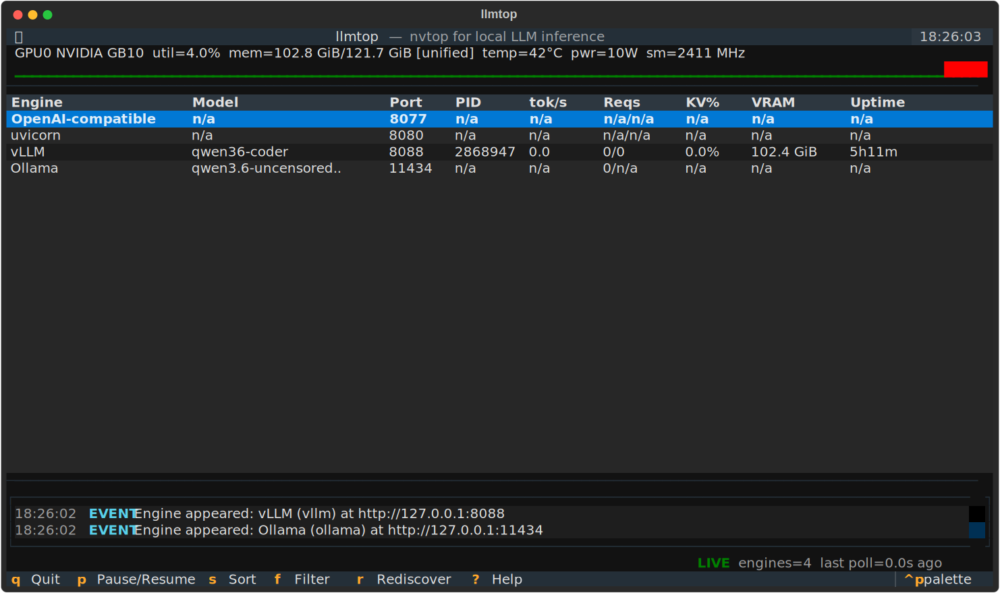

# llmtop

**An nvtop for local LLM inference.** Run one command and `llmtop` finds every
inference engine running on your machine, works out what models they are serving
and how they are configured, and shows live GPU and serving metrics in a
btop/nvtop-grade terminal UI.

Think "htop + nvtop, but it understands vLLM and llama.cpp."



```
llmtop
```

No flags. No config file. No manual port lists. It just finds everything.

---

## Why

If you run models locally you usually have several things going at once: a vLLM
server here, an Ollama daemon there, maybe a llama.cpp build and a router in
front of all of them. `nvidia-smi` tells you the GPU is busy but not *which*
engine, *which* model, how full the KV cache is, or how many requests are
queued. `llmtop` answers those questions in one screen.

## Features

- **Zero-config autodiscovery.** Cross-correlates three independent signals,
  process scan, port scan, and read-only API fingerprinting, so it finds engines
  with no flags and no port list.
- **Understands the engines.** Per engine it surfaces type and version, listen
  address, model id(s), quantization/dtype, context length, key backend flags,
  PID, uptime, and whether a model is loaded or idle/swapped-out.
- **Live serving metrics.** Decode and prefill tokens/sec, running vs waiting
  requests (queue depth), KV-cache utilization, and total tokens served, scraped
  from each engine's own metrics endpoint.
- **Real GPU telemetry** via NVML: utilization, memory, temperature, power,
  clocks, with sparkline history and color-coded pressure.
- **Unified-memory aware.** On NVIDIA GB10 / Jetson-class devices, where "VRAM"
  is shared with system RAM, `llmtop` detects it and labels memory correctly
  instead of reporting bogus totals. It still attributes per-engine GPU memory
  by walking the process tree, even when the engine runs as root or in a
  container.
- **Router topology.** Recognizes a LiteLLM/llm-router style proxy in front of
  several backends and renders the topology instead of double-counting.
- **Read-only and safe by default.** It never sends a generation request. Only
  cheap metrics/introspection endpoints are touched, so it never costs tokens or
  perturbs a live server.
- **Degrades gracefully.** No GPU, no engines, non-NVIDIA, partial metrics: it
  shows what is known and marks the rest `n/a`. It never crashes.
- **Headless mode.** `llmtop --json` dumps one discovery + metrics snapshot for
  scripting and monitoring.

## Supported engines

| Engine | Detection | Models | Metrics |
| --- | --- | --- | --- |
| vLLM | `/v1/models` + `vllm:` Prometheus series | id, context length | decode/prefill tok/s, running/waiting, KV% |
| Ollama | `/api/tags` | installed + loaded (`/api/ps`), quant, family | loaded-model count |
| llama.cpp server | `/health` + `/props` | model path, GGUF quant, n_ctx | tok/s, requests, KV% (when `/metrics` enabled) |
| TGI | `/info` | model id, max total tokens | queue, batch size, generated tokens |
| SGLang | `/get_model_info` | model path | running/queued, throughput, cache hit rate |
| OpenAI-compatible | `/v1/models` shape | served model ids | `/metrics` if present |
| Router (LiteLLM / llm-router) | many models mapping to other backends | per-backend | per-backend |
| Unknown | any HTTP response on a scanned port | n/a | n/a |

Auth-gated endpoints are handled too: a server that returns HTTP 401 is recorded
as present-but-blocked. Set `LLMTOP_API_KEY` (or `OPENAI_API_KEY`) and `llmtop`
will introspect it.

## Install

```bash
# Install straight from GitHub:
pip install git+https://github.com/rxxusp/llmtop.git

# or from a clone:
git clone https://github.com/rxxusp/llmtop && cd llmtop
pip install -e .
```

> Note: the bare name `llmtop` on PyPI belongs to an unrelated project, so there
> is no `pip install llmtop` for this tool. Install from GitHub as shown above.

Python 3.11+. Runtime deps: `textual`, `httpx`, `psutil`, `nvidia-ml-py`. The
NVML binding is harmless on non-NVIDIA hosts; GPU sampling simply reports `n/a`.

## Usage

```bash
llmtop                      # launch the TUI (autodiscovers everything)
llmtop --json               # one JSON snapshot to stdout, then exit
llmtop --once               # one human-readable table, then exit
llmtop --interval 1.0       # faster refresh
llmtop --port 9000 --port 9001   # also probe these ports
llmtop --no-gpu             # skip NVML (non-NVIDIA hosts)
```

### `--once`: a one-shot table

`llmtop --once` prints a single human-readable snapshot and exits, handy for a
quick check or a cron line. Real output from a DGX Spark (GB10) running vLLM,
Ollama, and a router (lightly trimmed):

```text
llmtop snapshot: 2026-06-20 02:11:36

GPUs
   #  Name                              Util                 Mem    Temp     Power
  --------------------------------------------------------------------------------
   0  NVIDIA GB10                       7.0%  58.6/121.7 GB (unified)  44.0°C     11.7W

System  CPU: 13.3%  RAM: 73.6/121.7 GB
        Load avg: 1.56 0.76 0.48

Engines
  Engine                Model                        Port    PID       tok/s   reqs(r/w)   KV%    Uptime
  ------------------------------------------------------------------------------------------------------
  openai-compatible     n/a                          8077    n/a       n/a     n/a         n/a    n/a
  unknown               n/a                          8080    n/a       n/a     n/a         n/a    n/a
  vllm                  qwen36-coder                 8088    3124190   n/a     0/0         0%     31h44m
  ollama                qwen3.6-uncensored:35b-a3b   11434   n/a       n/a     0/?         n/a    n/a
```

Note the `(unified)` memory label and the `n/a` cells: the router on `:8077` is
API-key-gated, so its model list and metrics read as present-but-blocked rather
than crashing the snapshot (set `LLMTOP_API_KEY` to introspect it).

### `--json`: a machine-readable snapshot

`llmtop --json` dumps one full discovery + metrics snapshot as JSON and exits.
Every field the TUI shows is present, plus per-process GPU memory and raw metric
series, so it is easy to pipe into a monitor or alert. Abridged real output:

```jsonc
{
  "timestamp": 1781935898.71,
  "gpus": [
    {
      "index": 0,
      "name": "NVIDIA GB10",
      "util_pct": 4.0,
      "mem_used_bytes": 62894620672,
      "mem_total_bytes": 130662936576,
      "temp_c": 44.0,
      "power_w": 10.98,
      "power_cap_w": null,      // NOT_SUPPORTED on GB10 -> null, not a crash
      "clock_sm_mhz": 2418,
      "clock_mem_mhz": null,    // NOT_SUPPORTED on GB10
      "fan_pct": null,          // NOT_SUPPORTED on GB10
      "throttled": false,
      "unified_memory": true,
      "procs": [
        { "pid": 3124886, "name": "VLLM::EngineCore", "gpu_mem_bytes": 61884448768 },
        { "pid": 3330298, "name": "firefox",          "gpu_mem_bytes":   353464320 }
      ],
      "note": "unified memory (shared with system RAM)",
      "error": null
    }
  ],
  "system": {
    "cpu_pct": 10.3, "cpu_count": 20,
    "ram_used_bytes": 79101251584, "ram_total_bytes": 130662936576,
    "load_avg": [1.56, 0.76, 0.48]
  },
  "engines": [
    {
      "engine_type": "openai-compatible",
      "name": "OpenAI-compatible",
      "base_url": "http://127.0.0.1:8077",
      "port": 8077,
      "models": [],
      "is_router": false,
      "signals": ["port-scan", "v1/models→401"],
      "last_error": "requires API key (set LLMTOP_API_KEY to introspect)"
    },
    {
      "engine_type": "vllm",
      "name": "vLLM",
      "port": 8088,
      "models": [{ "id": "qwen36-coder" }],
      "metrics": { "requests_running": 0, "kv_cache_pct": 0.0 }
    }
    // ... ollama, unknown ...
  ],
  "events": ["Engine appeared: vLLM (vllm) at http://127.0.0.1:8088"],
  "errors": []
}
```

(The JSON is strict JSON; the `//` comments above are only annotations for the
README.) The `procs` array is where per-engine GPU attribution comes from on
unified-memory boxes; see [GPU support](#gpu-support) below.

### Keybindings

| Key | Action |
| --- | --- |
| `q` | quit |
| `p` | pause / resume polling |
| `s` | cycle sort column |
| `f` | filter engines |
| `Enter` | toggle the detail pane for the selected engine |
| `r` | force a full re-discovery on the next poll |
| `?` | help |

## GPU support

GPU telemetry comes from NVML (`nvidia-ml-py`). On a normal discrete-GPU host
all fields populate as you would expect: utilization, memory used/total,
temperature, power + power cap, SM/memory clocks, and fan. `llmtop` keeps
sparkline history per GPU and color-codes pressure.

`llmtop` is built to never crash on a field NVML refuses to answer. Each metric
is read in its own guarded call, so a `NOT_SUPPORTED` on one field degrades that
field to `n/a`/`null` and leaves the rest intact.

### NVIDIA GB10 / DGX Spark (unified memory)

The GB10 (DGX Spark) and Jetson/Orin-class parts share a single pool of memory
between CPU and GPU, and several NVML queries return `NOT_SUPPORTED` there.
`llmtop` handles this specifically rather than reporting bogus numbers:

- **Memory.** `nvmlDeviceGetMemoryInfo` is `NOT_SUPPORTED` on GB10, so there is
  no separate "VRAM total/used" to read. `llmtop` detects this (both by the
  device name and by the failing call), flags the GPU as `unified_memory`, and
  uses the system memory total for capacity. The memory figure is labelled
  `(unified)` in the TUI and carries a `note: "unified memory (shared with
  system RAM)"` in `--json` so consumers know it is shared, not dedicated VRAM.
- **Power cap, memory clock, fan.** `nvmlDeviceGetEnforcedPowerLimit`,
  `nvmlDeviceGetClockInfo(NVML_CLOCK_MEM)`, and `nvmlDeviceGetFanSpeed` are all
  `NOT_SUPPORTED` on GB10. Those fields degrade to `null`/`n/a`
  (`power_cap_w`, `clock_mem_mhz`, `fan_pct`) while util, temperature, power
  usage, and SM clock still report normally.
- **Per-engine GPU memory.** Because there is no per-device VRAM readout,
  `llmtop` derives per-engine usage from NVML's per-process compute memory
  (`nvmlDeviceGetComputeRunningProcesses`) and attributes it by walking the
  process tree: each engine PID plus its `psutil` child processes are summed, so
  a vLLM worker that runs as a child (or under a different user) is still
  counted against its engine. Used memory for the whole unified pool is the sum
  of those per-process figures, falling back to `psutil.virtual_memory().used`
  when no process data is available. Processes that cannot be tied to a known
  engine are classified by their process tree instead.

The net effect on a DGX Spark: you see real GPU util/temp/power, a correctly
labelled unified-memory figure, and per-engine memory attribution, with the
genuinely unavailable knobs shown as `n/a` instead of fabricated zeros.

### Non-NVIDIA / no GPU

The NVML binding is harmless on hosts without an NVIDIA GPU; sampling simply
reports `n/a`. Pass `--no-gpu` to skip NVML entirely. Engine discovery and
serving metrics work the same with or without a GPU.

## Writing an adapter

Adding support for a new engine is one small module. An adapter teaches `llmtop`
how to recognize a server and how to read its models and metrics.

1. Create `llmtop/adapters/myengine.py`:

```python
from __future__ import annotations
from typing import Optional
import httpx
from ..models import Candidate, EngineInfo, EngineMetrics, EngineType
from .base import Adapter, derive_rate


class MyEngineAdapter(Adapter):
    engine_type = EngineType.UNKNOWN     # or add a value to EngineType
    default_ports = (5005,)
    priority = 40                        # lower = probed earlier

    @classmethod
    def detect(cls, candidate: Candidate, client: httpx.Client) -> Optional[EngineInfo]:
        # Probe a cheap, distinctive, read-only endpoint. Return None on a miss.
        try:
            r = client.get(f"{candidate.base_url}/my/info")
        except Exception:
            return None
        if r.status_code != 200:
            return None
        return EngineInfo(
            engine_type=cls.engine_type, name="MyEngine",
            base_url=candidate.base_url, host=candidate.host, port=candidate.port,
            pid=candidate.pid, process=candidate.process,
        )

    def describe(self, engine: EngineInfo, client: httpx.Client) -> None:
        ...   # fill engine.models / version / flags in place

    def metrics(self, engine, client, previous=None, dt=None) -> EngineMetrics:
        ...   # return live metrics; use derive_rate(now, prev, dt) for tok/s
```

2. Register it in `llmtop/adapters/__init__.py` (add it to `_DETECTORS`).

That is the entire extension path. See `ARCHITECTURE.md` for the full contract
and the existing adapters for worked examples.

### Adapter rules

- **Read-only.** Never call a completion/generation endpoint.
- **Time-bounded.** Use the provided `client` (short timeout). Never block.
- **Degrade, never raise.** Catch your own errors and return `None` or
  `EngineMetrics(error=...)`.

## How discovery works

1. **Process scan** walks the process table for known launchers (`vllm serve`,
   `llama-server`, `ollama`, `text-generation-launcher`, `sglang.launch_server`,
   and generic `--port`/`--model` patterns).
2. **Port scan** checks common serving ports plus any ports owned by those
   processes.
3. **API fingerprinting** probes each open port with cheap read-only calls and
   classifies by response shape.
4. **Router correlation** detects a proxy advertising many models that map onto
   other discovered engines and renders the topology.

## Non-goals (v1)

- No generation or benchmarking that consumes tokens.
- No remote/multi-host aggregation (single machine only).
- No web UI. Terminal only.

## License

MIT. See [LICENSE](LICENSE).
